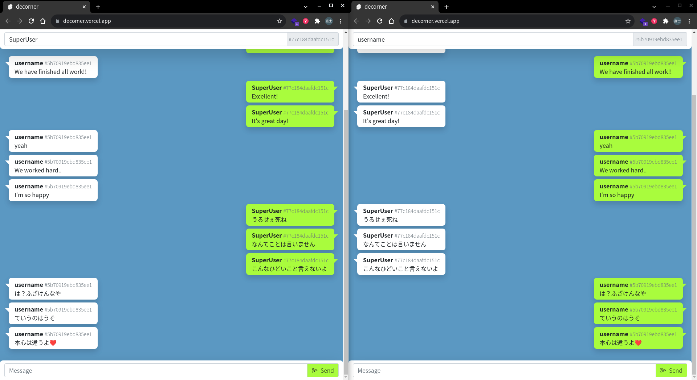

# [decorner](https://decorner.vercel.app)

[decorner](https://decorner.vercel.app)

悪口や非難するようなワードを投稿すると, 勝手に謝罪･訂正のメッセージを送信します.

たとえ険悪な空気から思わず強い言葉で相手を非難してしまっても, decornerが角が立たないように丸く収めてくれます.

## dev

- [omae-muds](https://github.com/omae-muds)
- [Hayashikotarou](https://github.com/Hayashikotarou)

---

- Vercel: [omae-muds/decorner](https://vercel.com/omae-muds/decorner)
- Pusher: [channels/decorner](https://dashboard.pusher.com/apps/1284698)

---

- Pusher.js
- Vercel
- Vercel Serverless Functions
- Svelte.js
- Bootstrap5
- ionicons